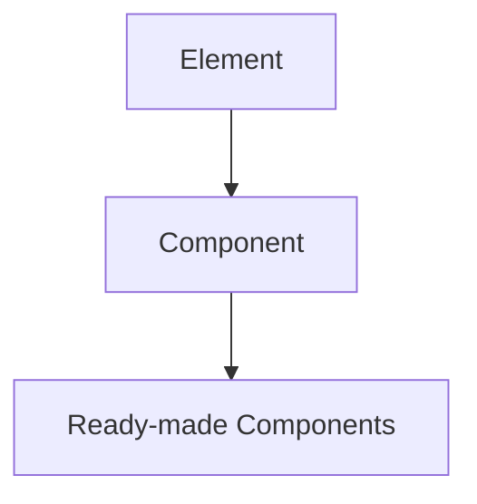

# Core Concepts

htmforge is built in three layers:

- Layer 1: Element
  - `Element` represents a single HTML tag and implements `to_html()`.
  - Attribute mapping rules: `cls` → `class`, `for_` → `for`, `hx_get` → `hx-get`.
  - Boolean `True` renders as a flag, `None`/`False` are omitted.

- Layer 2: Component
  - `Component` is a `pydantic.BaseModel` with an abstract `render()`.
  - `to_html()` delegates to `render()` and returns the full HTML string.
  - `htmx_attrs()` collects only set `hx_*` properties and serializes dicts.

- Layer 3: Ready-made components
  - Reusable high-level components (Badge, Breadcrumb, Modal, etc.)

