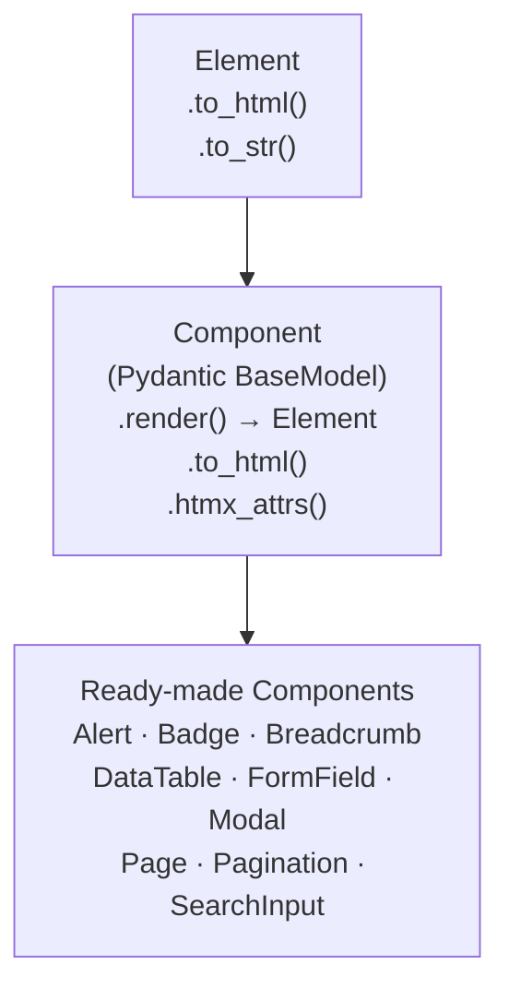

# Core Concepts

htmforge is built in three layers:

## Layer 1: Element

`Element` represents one HTML tag and handles safe HTML rendering.

Attribute mapping rules:

| Python argument | HTML attribute | Rule                    |
|-----------------|----------------|-------------------------|
| `cls="foo"`       | `class="foo"`    | `cls` → `class`             |
| `for_="id"`       | `for="id"`       | trailing `_` stripped       |
| `hx_get="/url"`   | `hx-get="/url"`  | `_` → `-` inside name       |
| `disabled=True`   | `disabled`       | `True` → flag only        |
| `hidden=False`    | `(omitted)`      | `False`/`None` → omitted    |

Boolean `True` renders as a flag, while `False` and `None` are omitted.

## Layer 2: Component

`Component` is a `pydantic.BaseModel` with an abstract `render()` method. `to_html()` delegates to `render()`, and `htmx_attrs()` collects only the set `hx_*` fields while serializing dict values compactly.

## Layer 3: Ready-made components

Reusable high-level components include Alert, Badge, Breadcrumb, DataTable, FormField, Modal, Page, Pagination, and SearchInput.

```mermaid
flowchart TD
  E["Element\n.to_html()\n.to_str()"] --> C["Component\n(Pydantic BaseModel)\n.render() → Element\n.to_html()\n.htmx_attrs()"]
  C --> RC["Ready-made Components\nAlert · Badge · Breadcrumb\nDataTable · FormField · Modal\nPage · Pagination · SearchInput"]
```
